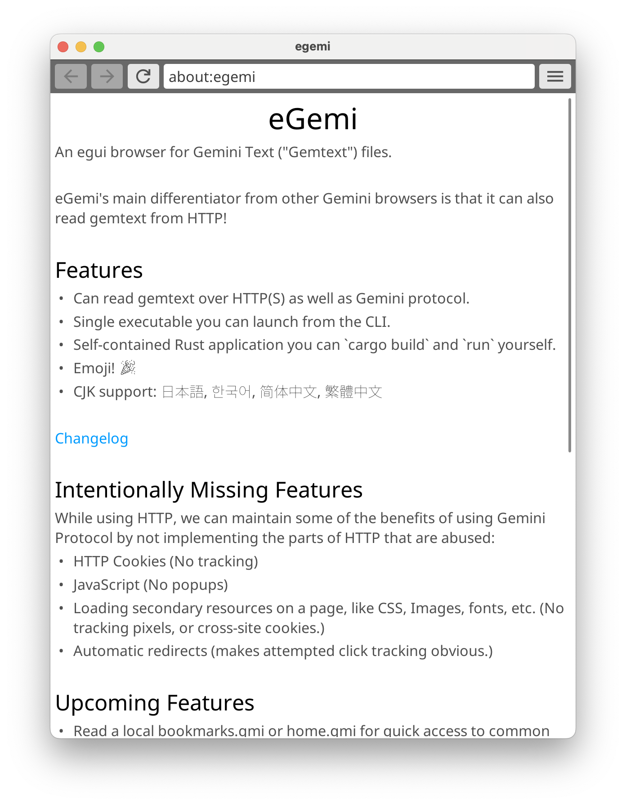
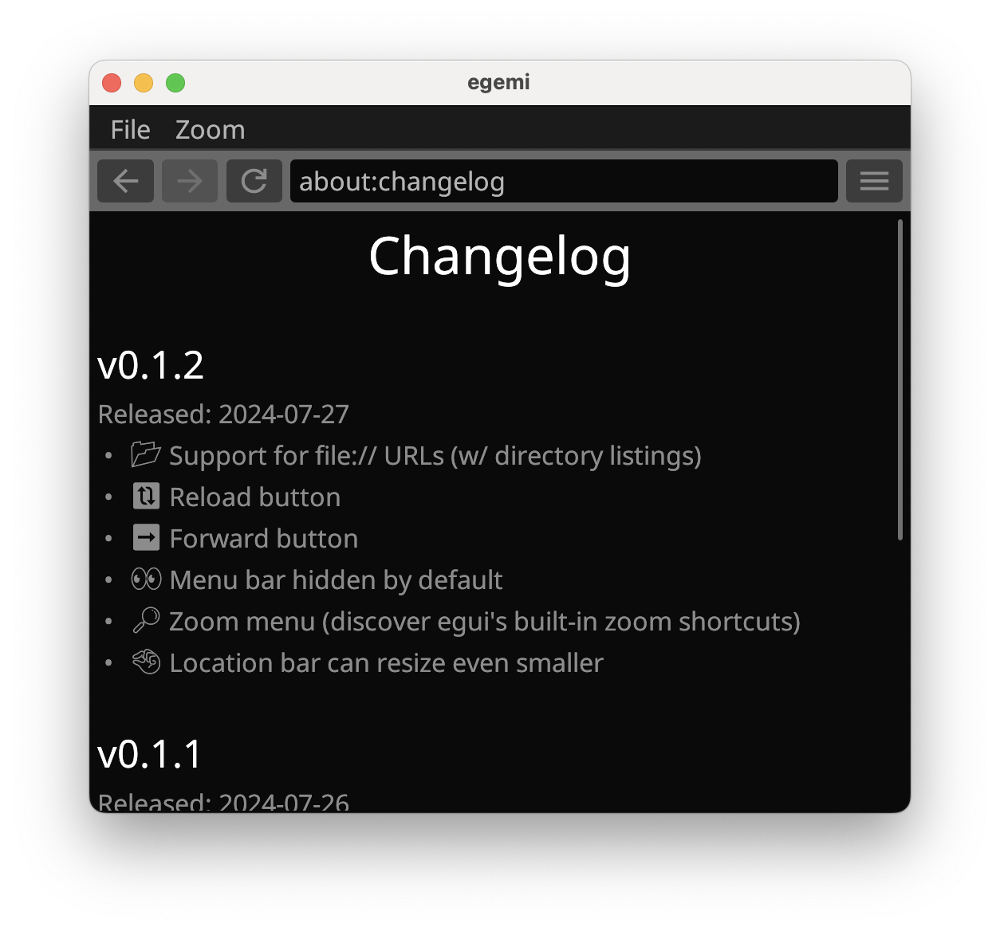

# eGemi

An egui web browser for Gemini text and the small web.

Unlike other Gemini browsers, it allows you to browse Gemtext and plaintext via HTTP too.

See [welcome.gmi] for more details. 

## Screenshots

## Installation

eGemi doesn't have a binary distribution, but it's easy to build from source.

 * [Install Cargo]
 * `git clone` this repo.
 * `cargo run --release`

If you want to build and install the `egemi` binary onto your system, instead run:

 * `cargo install --path .`

[welcome.gmi]: ./welcome.gmi
[Install Cargo]: https://doc.rust-lang.org/cargo/getting-started/installation.html
